# Installing

This guide covers getting Melodee running quickly using containers, plus optional native dev setup.

## Option 1: Container Deployment (Recommended)

### Prerequisites

- Docker or Podman (with podman‑compose if using Podman)
- At least 2GB RAM (4GB recommended for large scans)
- At least 5GB free disk space
- Persistent storage volumes or bound host directories

### Automated Setup (Easiest)

For a fully automated setup, use our container setup script:

```bash
# Clone the repository
git clone https://github.com/sphildreth/melodee.git
cd melodee

# Run the setup script (checks prerequisites, creates .env, optionally starts containers)
python3 scripts/run-container-setup.py --start
```

The script will:
- Run preflight checks (disk space, memory, port availability, required files)
- Detect your container runtime (Podman or Docker)
- Offer to install Podman if no runtime is found
- **Ask if you want to create a dedicated `melodee` system user** (recommended for multi-user servers)
- Generate a secure `.env` file with random passwords and JWT tokens
- Build the container image
- Start the containers
- Wait for health checks to pass
- Provide you with the URL to access Melodee

#### User Configuration

The setup script offers two user configurations:

**Option 1: Current User (Simple, Homelab)**
- Containers run as your current user
- Files owned by your user
- Best for single-user homelab setups
- No additional setup required

**Option 2: Dedicated melodee User (Recommended for Servers)**
- Creates a `melodee` system user
- Containers run as the melodee user  
- Multiple users can be added to the `melodee` group for shared access
- Best for multi-user servers, CI/CD deployments, production environments

**When to use dedicated melodee user:**
- Demo/production servers with multiple admins
- CI/CD deployments (e.g., GitHub Actions deploy user + admin user)
- Shared server environments
- When you want consistent ownership regardless of who manages the server

**Example multi-user scenario:**
```bash
# After setup creates melodee user:
sudo usermod -aG melodee steven   # Admin can access files
sudo usermod -aG melodee deploy   # CI/CD user can access files
# Both users can now manage Melodee files
```

#### Setup Script Options

```bash
# Just run checks without making changes
python3 scripts/run-container-setup.py --check-only

# Start containers after setup
python3 scripts/run-container-setup.py --start

# Overwrite existing .env without prompting
python3 scripts/run-container-setup.py --force

# Update existing containers to latest code (see Upgrading section)
python3 scripts/run-container-setup.py --update

# Skip confirmation prompts (for automated/CI deployments)
python3 scripts/run-container-setup.py --update --yes
```

### Manual Setup

If you prefer to set up manually:

#### 1. Clone & Configure

```bash
git clone https://github.com/sphildreth/melodee.git
cd melodee
cp example.env .env
```

Edit `.env` values:

```bash
DB_PASSWORD=change_me_to_a_secure_password
MELODEE_PORT=8080
MELODEE_AUTH_TOKEN=change_me_to_a_64_character_random_string
```

#### 2. Build and Launch

```bash
# Podman (build first, then start)
podman compose build
podman compose up -d

# Or Docker
docker compose up -d --build
```

Access: http://localhost:8080 — create the first user (becomes admin).

### 3. Provide Music Directories

The compose file defines volumes for:

- inbound: Drop new raw media here.
- staging: Holds processed media awaiting approval.
- storage: Canonical library (served to clients).

Mount or copy your music appropriately. The job engine will pick up changes on schedule (or trigger a scan manually in the UI / CLI).

### 4. Upgrading

The safest way to upgrade is using the setup script's `--update` flag:

```bash
cd /path/to/melodee
git pull
python3 scripts/run-container-setup.py --update
```

This will:
- Show current container status
- Build a fresh image with the latest code
- Recreate containers (preserving all data volumes)
- Run any new database migrations automatically
- Wait for health checks to pass

For automated/CI deployments, add `--yes` to skip confirmation:

```bash
git pull && python3 scripts/run-container-setup.py --update --yes
```

#### Manual Upgrade

If you prefer manual commands:

```bash
git pull origin main
podman compose build      # Rebuild with new code
podman compose up -d      # Recreate containers (volumes preserved)
```

**Important:** Your data volumes (database, media, playlists, etc.) are preserved during upgrades. Only the container images are replaced.

#### What Gets Preserved During Upgrades

| Component | Preserved? | Notes |
|-----------|------------|-------|
| Database (PostgreSQL) | ✅ Yes | `melodee_db_data` volume |
| Media library | ✅ Yes | `melodee_storage` volume |
| User images | ✅ Yes | `melodee_user_images` volume |
| Playlists | ✅ Yes | `melodee_playlists` volume |
| Logs | ✅ Yes | `melodee_logs` volume |
| `.env` configuration | ✅ Yes | On host filesystem |
| Container image | ❌ Replaced | New code deployed |

## Homelab Deployment Options

### Option A: Standalone Container Deployment

For basic homelab setups, the default `compose.yml` is sufficient. Simply run:

```bash
git clone https://github.com/sphildreth/melodee.git
cd melodee
python3 scripts/run-container-setup.py --start
```

### Option B: Reverse Proxy with HTTPS

For homelabs exposed to the internet or requiring SSL, configure a reverse proxy:

**Nginx Proxy Manager Configuration:**
- Domain: your-music.domain.com
- Scheme: http
- Host: 127.0.0.1 (if running on same machine)
- Port: 8080 (or whatever MELODEE_PORT is set to)

**Traefik Configuration (docker-compose):**
```yaml
services:
  melodee.blazor:
    # ... existing config ...
    labels:
      - "traefik.enable=true"
      - "traefik.http.routers.melodee.rule=Host(`music.your-domain.com`)"
      - "traefik.http.routers.melodee.tls=true"
      - "traefik.http.routers.melodee.entrypoints=websecure"
```

### Option C: Docker Swarm Deployment

For high availability homelabs:

```bash
# Initialize swarm
docker swarm init

# Deploy as stack
docker stack deploy -c compose.yml melodee
```

### Option D: Hardware Optimization

For homelabs with large collections:

- **CPU**: Multi-core processor recommended (parallel transcoding)
- **RAM**: 8GB+ for large libraries (tens of thousands of tracks)
- **Storage**: SSD for database, spinning drives for media
- **Network**: Gigabit Ethernet for streaming performance

## Option 2: Local Development (Source)

Prerequisites: .NET 10 SDK, PostgreSQL 17 (or use the compose DB service), ffmpeg in PATH (for transcoding), optional: imagemagick.

```bash
dotnet restore
dotnet run --project src/Melodee.Blazor
```

For CLI utilities:

```bash
dotnet run --project src/Melodee.Cli -- --help
```

## Initial Configuration Steps

1. Add or verify library paths in the configuration section of the UI.
2. Configure metadata providers (supply API keys where required).
3. Kick off an initial full scan (Jobs panel) to index existing media.
4. Review staging items, edit metadata/artwork, promote to storage.
5. Connect clients (OpenSubsonic URL usually: http://host:port). Use your username + password / token.

### Data path (simplified):

```mermaid
flowchart LR
	A[Inbound Files &#40;Raw Media&#41;] --> B[Ingestion / Conversion Normalization & Validation]
	B --> C[Staging Manual Edits & Artwork]
	C --> D[Storage Libraries Canonical Media]
	D --> E[Indexed DB Metadata Search & Stats]
	E --> F[APIs / Streaming OpenSubsonic + Native REST]

	%% Style definitions &#40;single class applied to all for now&#41;
	classDef proc fill:#4e79a7,stroke:#1f3349,color:#fff;
	class A,B,C,D,E,F proc
```



## Backups

Primary data to retain:

- PostgreSQL volume (melodee_db_data)
- Media volumes (storage + artwork)
- User images & playlists volumes

Example (Podman):

```bash
podman volume export melodee_db_data > db_backup_$(date +%F).tar
podman volume export melodee_storage > storage_backup_$(date +%F).tar
```

### Automated Backup Script

Create a backup script for homelab automation:

```bash
#!/bin/bash
# backup-melodee.sh

BACKUP_DIR="/backup/melodee/$(date +%Y-%m-%d)"
mkdir -p "$BACKUP_DIR"

# Export volumes
podman volume export melodee_db_data > "$BACKUP_DIR/db_backup.tar"
podman volume export melodee_storage > "$BACKUP_DIR/storage_backup.tar"
podman volume export melodee_user_images > "$BACKUP_DIR/user_images_backup.tar"
podman volume export melodee_playlists > "$BACKUP_DIR/playlists_backup.tar"

# Compress backups
gzip "$BACKUP_DIR"/*.tar

# Optional: Upload to cloud storage
# aws s3 sync "$BACKUP_DIR" s3://your-backup-bucket/melodee/

echo "Backup completed: $BACKUP_DIR"
```

Schedule with cron:
```bash
# Daily backup at 2 AM
0 2 * * * /path/to/backup-melodee.sh
```

## Troubleshooting

| Symptom | Suggestion |
|---------|------------|
| "short-name did not resolve" error | Run `podman compose build` before `up`, or ensure image is built |
| High CPU during first run | Normal while initial scan & metadata enrichment proceeds. | 
| Streams 429 Too Many Requests | Reduce concurrent streams or adjust limiter settings (coming soon to config). |
| Client fails auth | Verify first user created; rotate API key if compromised. |
| Missing artwork | Ensure metadata jobs ran; trigger artwork refresh job. |
| Container not healthy | Run `podman compose logs -f` to see application logs |
| Port already in use | Change `MELODEE_PORT` in `.env` file |
| Permission denied on volume files (rootless podman) | The setup script should create `compose.override.yml` automatically. If missing, see below. |

### Rootless Podman Permission Issues

If you're using **rootless podman** and encounter permission errors when accessing files in volumes (e.g., uploaded media in the inbound directory), the setup script automatically creates a `compose.override.yml` file to fix this.

**How it works:**
- Rootless podman uses user namespace mapping where container UIDs don't match host UIDs
- The override file runs the container as your host user (e.g., UID 1000) instead of the default UID 0
- Files created in volumes are then owned by your host user

**If you see permission errors:**

1. Re-run the setup script: `python3 scripts/run-container-setup.py`
2. Or manually create `compose.override.yml` with your UID/GID:

```yaml
# compose.override.yml (for rootless podman only)
services:
  melodee.blazor:
    user: "1000:1000"  # Replace with your UID:GID from 'id' command
    environment:
      - MELODEE_RUNNING_AS_USER=true
```

3. Restart containers: `podman compose down && podman compose up -d`

**To check if you're affected:**
- Run `podman info --format='{{.Host.Security.Rootless}}'`
- If it returns `true`, you're using rootless podman
- The setup script handles this automatically

**Note:** This issue does **not** affect Docker or rootful (sudo) Podman.

### Container Diagnostics

```bash
# Check container status
podman compose ps

# View live logs
podman compose logs -f

# View logs for specific service
podman compose logs melodee.blazor

# Check container health
podman inspect melodee_melodee.blazor_1 --format='{{.State.Health.Status}}'

# Run preflight checks
python3 scripts/run-container-setup.py --check-only
```

## Next Steps

- Read: /configuration/ for deeper tuning.
- Explore: /api/ for custom integrations.
- Contribute: /about/ for roadmap & community links.

